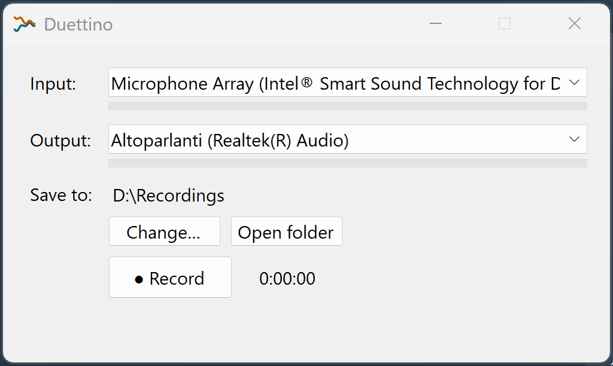
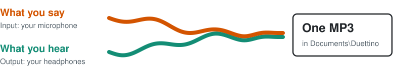

<picture>
  <source media="(prefers-color-scheme: dark)" srcset="assets/web/icon-dark.svg">
  
</picture>

# Duettino

**Records what you say and what you hear.**

On headphones, the other side of a call never leaves your computer, so a recorder on the desk hears only you. Duettino is a small, free Windows app that records your microphone and what plays in your headphones at the same time, into one MP3.

Teams and Zoom can record a meeting themselves, but only when the organizer or your company allows it, and WhatsApp or Discord calls can't be recorded that way at all. Duettino works with any of them, because it records your own computer, not the call.



## Download

**[Download Duettino.exe](https://github.com/fakkio/duettino/releases/latest/download/Duettino.exe)** · [All releases](https://github.com/fakkio/duettino/releases)

0.1.0 beta · ~55 MB · Windows 10/11 64-bit · nothing to install, no .NET needed

It's a beta, tested on my own hardware: please [report what breaks](https://github.com/fakkio/duettino/issues).

> [!NOTE]
> The first time, Windows may say "Windows protected your PC", because Duettino is new and Windows doesn't know it yet: click **More info**, then **Run anyway**. The [FAQ](#faq) explains why, and how to check the file is the one I published.

## How to record a Teams or Zoom call with headphones

<picture>
  <source media="(prefers-color-scheme: dark)" srcset="assets/web/how-it-works-dark.svg">
  
</picture>

1. **Pick your microphone as the Input and your headphones as the Output.** If you have more than one pair, pick the one your call app plays on. They don't have to be one headset: a USB microphone with the laptop's speakers works too.
2. **Press Record.** A meter for each side moves as you talk and listen, and a timer runs.
3. **Press Stop.** A few seconds later the MP3 is in `Documents\Duettino`, named after the time you started, like `Duettino_2026-10-07_15-30-00.mp3`. An hour takes about 60 MB.

That's all the setup there is: no plugin, no bot joining the call, nothing to change in the call app.

## Not only calls

Calls are what Duettino was made for, but it records whatever your computer plays, together with your voice. No studio to set up:

- **Webinars and online lessons**: the speaker, and the questions you asked.
- **Commentated videos**: your voice over the video or stream you're watching.
- **Gaming**: the game and your voice in one file, without setting up OBS.
- **Practice over a backing track**: sing or play along, then hear how the two sound together.
- **Remote podcasts**: your guest through the call and you through your microphone, in one file.

## What it takes care of

- **Both sides equally loud.** A quiet microphone doesn't vanish under a loud call, and nothing distorts when someone raises their voice. When you're silent, your room's hum isn't turned up.
- **In sync for hours.** Your voice and the call stay together through long calls, silences and system hiccups, even though two devices never run at exactly the same speed.
- **Devices that come and go.** Pull the headphone jack or put the earbuds back in their case mid-call: Duettino switches to the Windows default device, and back when yours returns. With no device left, it records silence instead of stopping.
- **Nothing lost to a crash.** If Duettino or Windows closes mid-recording, the next launch offers to recover what was recorded. If something goes wrong that Duettino can't fix, it stops, keeps what it has and tells you why.
- **Safe to close.** Closing during a recording asks "Stop and save?" first, and waits for the file to be written.
- **No drivers, no Stereo Mix.** Duettino uses a feature built into Windows: no virtual cable to install, nothing to change in the sound settings, and any microphone, headphones or speakers work.
- **Remembers your setup.** Your microphone, headphones and folder are remembered. If one isn't connected, Duettino uses the Windows default and tells you.
- **Says what's wrong.** If Windows blocks the microphone, Duettino says where to allow it, and starts recording it as soon as you do.
- **English and Italian.** The window speaks Italian on an Italian Windows, English everywhere else.

## FAQ

<details>
<summary>Why not just use Stereo Mix?</summary>

Stereo Mix exists only on some sound cards, is often missing or turned off on Windows 11, and captures only what plays on its own sound card, not your USB or Bluetooth headphones. You'd still need a second program for your microphone, and a way to line the two up afterwards.

Duettino records any headphones or speakers, USB and Bluetooth included, and your microphone alongside them, in sync.

</details>

<details>
<summary>Does it work with Bluetooth headphones?</summary>

Yes, with a limit that comes from Bluetooth itself. While the headset's own microphone is in use, by Duettino or by the call app, Windows switches the headset to a hands-free mode that sounds like an old phone call: muffled, with no highs. Everything you hear on the headset sounds like that, not only the call, and so does the recording. Each switch also leaves a second or two of silence, in your ears and in the recording.

For full quality, use another microphone, such as the laptop's own or a USB one, in both Duettino and the call app.

</details>

<details>
<summary>Can I record my mic and speakers at the same time, without headphones? Will it echo?</summary>

Yes, but your microphone hears the speakers too, so the other side ends up in the recording twice, about a tenth of a second apart, as an echo. Call apps cancel that echo in the call, not in what Duettino records. How much you hear depends on the microphone: a laptop's built-in one often filters most of it out, a separate one may not filter it at all. Headphones avoid it.

</details>

<details>
<summary>Does it upload anything?</summary>

No. Duettino records only on your PC and never connects to the network: no account, no telemetry, no analytics. Your recordings stay in the folder you choose, and the only other file it writes is a small settings file (your devices and folder) in `%AppData%\Duettino`.

</details>

<details>
<summary>Windows says it protected my PC. Is it safe?</summary>

That's SmartScreen. It appears for programs that aren't signed with a paid certificate and haven't been downloaded by many people yet. Click **More info**, then **Run anyway**.

To check the file is the one I published, compare the SHA-256 in the release notes with what `Get-FileHash Duettino.exe` prints in PowerShell. All the source code is here, and you can [build it yourself](#build-from-source).

</details>

<details>
<summary>No MP3 on Windows N: why did I get a WAV?</summary>

Windows N editions leave out the MP3 encoder Duettino uses. Duettino then saves a WAV file, bigger but with the same sound, and tells you how to get MP3: install the Media Feature Pack from *Settings › Apps › Optional features › Add a feature*.

</details>

<details>
<summary>Is it legal to record a call?</summary>

It depends on where you and the other people are. The simple rule: tell the others you're recording. Unlike the recording built into Teams or Zoom, Duettino notifies nobody, so that part is up to you. This isn't legal advice; check your local law.

</details>

<details>
<summary>Is it Audio Hijack for Windows, or an OBS alternative for audio only? How does it compare to Audacity?</summary>

- **OBS Studio** can record audio only, after some setup, but it's built for video and streaming.
- **Audacity** records from one sound device at a time, so your microphone and the computer's sound have to be merged into one first, with Stereo Mix or a virtual cable.
- **Audio Hijack** does this and much more, but only on a Mac.

Duettino does just this one job: two devices, one button, one MP3.

</details>

## Build from source

You need Windows and the [.NET 10 SDK](https://dotnet.microsoft.com/download/dotnet/10.0).

```
git clone https://github.com/fakkio/duettino.git
cd duettino
dotnet publish src/Duettino -p:PublishProfile=win-x64
```

The executable is written to `src/Duettino/bin/publish/win-x64/`.

## How it's made

Duettino is designed, tested on real hardware and reviewed by me, [Fabio Lazzaroni](https://fabiolazzaroni.dev). The code is written with AI coding agents (Claude Code). Every decision, with the alternatives turned down, is recorded in [`docs/adr`](docs/adr). The workflow (grilling the brief, ADRs, spec → tickets, TDD) runs on [Matt Pocock's skills](https://github.com/mattpocock/skills).

## License

[MIT](LICENSE). Use it, change it, share it.
